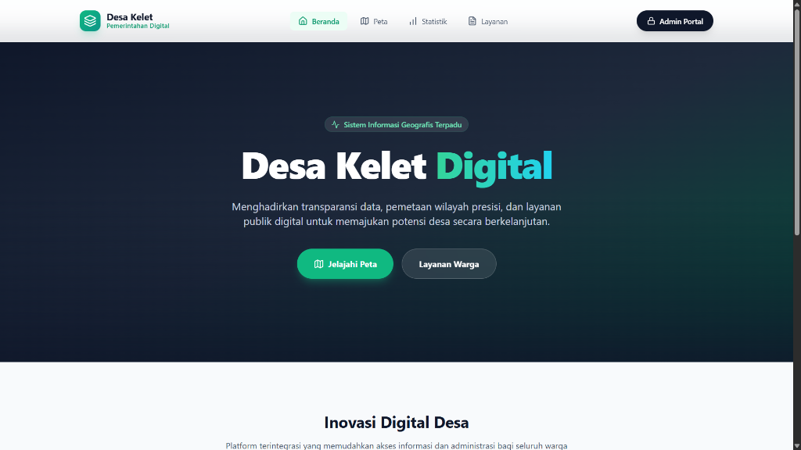
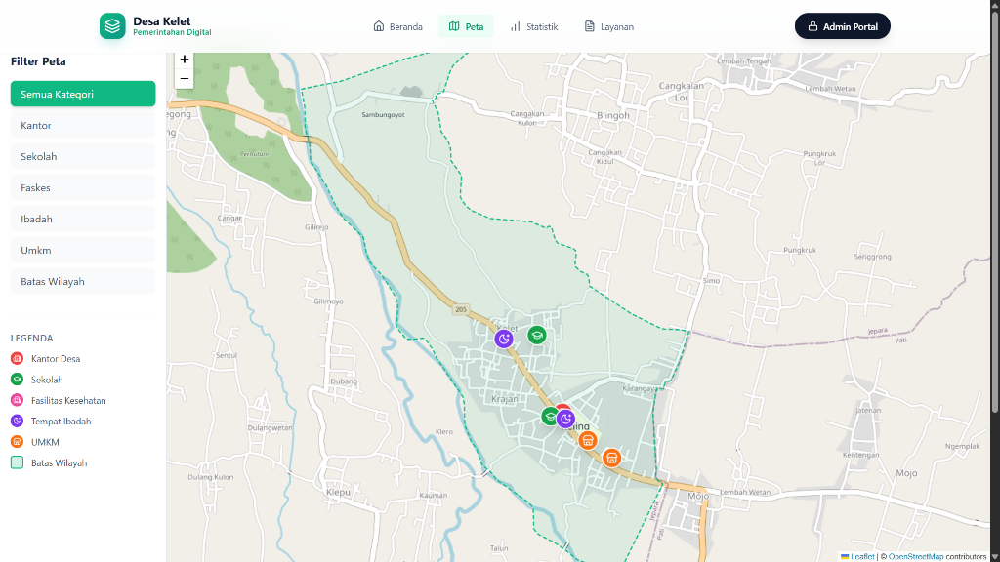
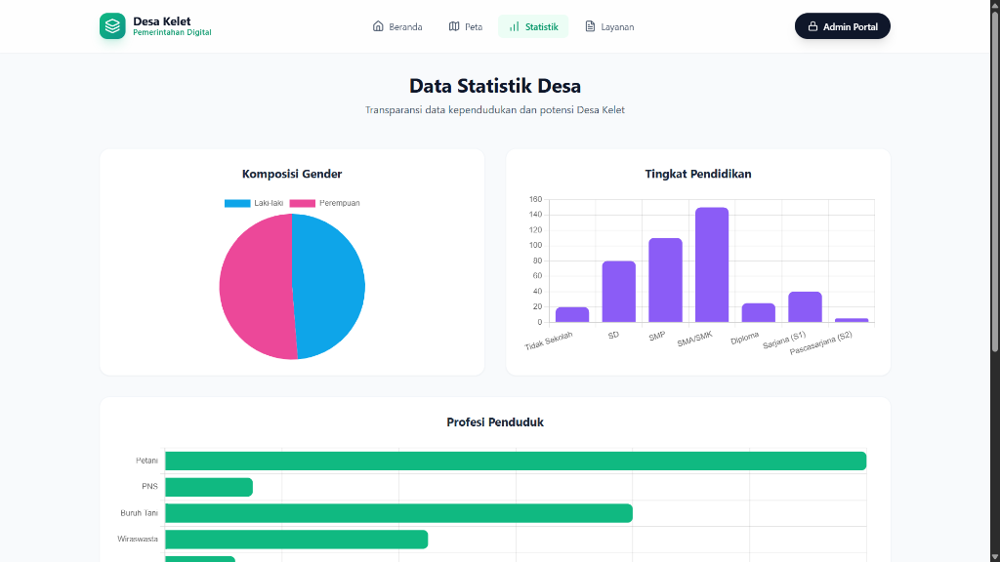
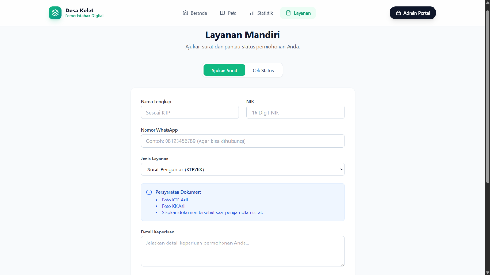

# GIS Desa Kelet (Sistem Informasi Geografis desa)

**GIS Desa Kelet** adalah aplikasi berbasis web yang dirancang untuk memetakan fasilitas umum, batas wilayah, dan data kependudukan Desa Kelet secara digital. Aplikasi ini bertujuan mendukung transparansi informasi dan "Pemerintahan Digital" yang modern.


## 🌟 Fitur Utama

### 🌍 Modul Publik (Warga)

#### 1. Beranda & Informasi Desa
Halaman depan yang modern menampilkan akses cepat ke fitur utama dan informasi terkini desa.


#### 2. Peta Digital Interaktif
Visualisasi lengkap lokasi fasilitas umum (sekolah, faskes, UMKM) dan batas wilayah Dusun/RW.


#### 3. Statistik Kependudukan
Transparansi data demografi desa yang disajikan dalam bentuk grafik dan diagram yang mudah dipahami.


#### 4. Layanan Mandiri
Fitur pengajuan surat pengantar online yang praktis, lengkap dengan informasi persyaratan dan cek status.


### 🔒 Modul Admin (Perangkat Desa)
*   **Dashboard Eksekutif**: Ringkasan aktivitas dan data real-time.
*   **Manajemen GIS**: Tambah/Edit lokasi dan upload batas wilayah (GeoJSON).
*   **Manajemen Layanan**: Verifikasi permohonan warga dan cetak draft surat otomatis.
*   **WhatsApp Follow-up**: Hubungi warga langsung dari dashboard.

## 🛠️ Teknologi yang Digunakan
*   **Frontend**: React.js (Vite), Tailwind CSS, Leaflet.js (Maps), Lucide React (Icons).
*   **Backend**: Native PHP (REST API).
*   **Database**: SQLite (Ringan & Serverless).

## 🚀 Panduan Instalasi

Ikuti langkah-langkah berikut untuk menjalankan aplikasi di komputer lokal Anda.

### Prasyarat
Pastikan Anda sudah menginstal:
*   [Node.js](https://nodejs.org/) (v16+)
*   [PHP](https://www.php.net/) (v8.0+)

### 1. Clone Repository
```bash
git clone https://github.com/ReviArda/GIS-Kelet.git
cd GIS-Kelet
```

### 2. Setup Backend (PHP)
Backend menggunakan Native PHP dan SQLite, sehingga tidak perlu konfigurasi server database rumit.

1.  Masuk ke folder backend:
    ```bash
    cd backend
    ```
2.  Jalankan server PHP:
    ```bash
    php -S localhost:8000 -t public
    ```
    *Backend sekarang berjalan di `http://localhost:8000`*

### 3. Setup Frontend (React)
1.  Buka terminal baru dan masuk ke folder frontend:
    ```bash
    cd frontend
    ```
2.  Install dependencies:
    ```bash
    npm install
    ```
3.  Jalankan aplikasi:
    ```bash
    npm run dev
    ```
    *Frontend sekarang berjalan di `http://localhost:5173`*

## 🔑 Akun Default (Admin)
Untuk masuk ke **Admin Portal**:
*   **URL**: `http://localhost:5173/admin/login`
*   **Username**: `admin`
*   **Password**: `password123`

## 🤝 Kontribusi
Project ini dikembangkan untuk tujuan edukasi dan open source. Silakan *fork* dan ajukan *pull request* jika ingin berkontribusi!

---
**Desa Kelet - Pemerintahan Digital**
*Developed by Revi Arda*
